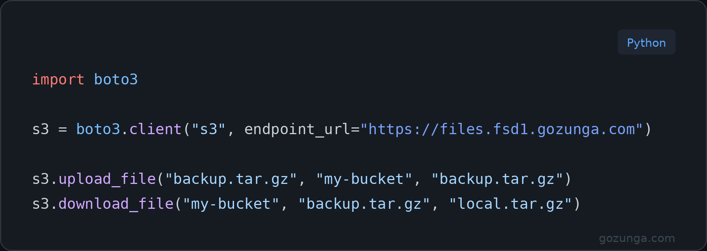

# Gozunga Cloud — API Examples

Code examples for the [Gozunga Cloud](https://gozunga.com) platform.  
S3-compatible object storage, compute, and more.

---



---

## Examples

| Service | Language | Library | Folder |
|---------|----------|---------|--------|
| Object Storage | Python | boto3 | [object-storage/python/](object-storage/python/) |
| Compute | Python | openstacksdk | [compute/python/](compute/python/) |

## Object Storage

**Endpoint:** `https://files.fsd1.gozunga.com`  
S3-compatible — works with boto3, the AWS CLI, rclone, s3cmd, and any other S3 tool.

```bash
cd object-storage/python
cp .env.example .env   # add your credentials
pip install -r requirements.txt
python s3_example.py
```

## Compute

Manage virtual servers using the OpenStack SDK.

```bash
cp .env.example .env   # add your application credentials
pip install -r requirements.txt
python example.py
```

## Credentials & Auth

- **Object Storage** — Access key + secret from the portal: **Object Storage → Access Keys**
- **Compute** — Application credentials from the portal: **Identity → Application Credentials**

Portal: [cloud.fsd1.gozunga.com](https://cloud.fsd1.gozunga.com)  
Docs: [gozunga.com/docs](https://gozunga.com/docs)

## Contributing

PRs welcome — especially for additional languages (Node.js, Go, Ruby, etc.).
